<p align="center">
  <a href="design/gamma-wordmark.svg">
    
  </a>
</p>

<p align="center">
  <a href="https://github.com/JUSTINWMYLES/gamma/actions/workflows/ci.yml"></a>
  <a href="https://github.com/JUSTINWMYLES/gamma/actions/workflows/release.yml"></a>
  <a href="LICENSE"></a>
  
</p>

---

A networked multiplayer party game framework where phones are controllers and a TV, laptop, or projector is the shared display. Built with Colyseus (server), Svelte + Tailwind (client), and TypeScript throughout.

---

> [!NOTE] 
> This is a hobby project maintained in my spare time. The game framework and individual games are currently bundled together — splitting them out is on the roadmap but not a priority. A Kubernetes operator-based deployment is the intended production path, but cloud pricing is rough out there so I'll deal with that later.

---

## Quickstart: Run Locally

```bash
# 1. Install all dependencies (server + client)
make install

# 2. Copy environment file
cp .env.example .env

# 3. Start everything (server + client in parallel)
make dev
```

Open in your browser:
- **View screen / TV display**: http://localhost:5173 (select "Host a Room")
- **Phone controller**: http://localhost:5173 on a phone or second tab (select "Join")
- **Server health**: http://localhost:2567/health

---

## Quickstart: Docker Compose

```bash
docker compose up --build
```

- Client: http://localhost:5173
- Server: ws://localhost:2567

---

## Project Structure

```
gamma/
├── server/                        # Colyseus game server (Node.js + TypeScript)
│   ├── src/
│   │   ├── index.ts               # HTTP + WebSocket server entry point
│   │   ├── telemetry.ts           # OpenTelemetry tracer + meter
│   │   ├── rooms/
│   │   │   └── GammaRoom.ts       # Main Colyseus room — all sessions
│   │   ├── schema/                # Colyseus Schema (replicated state)
│   │   │   ├── RoomState.ts
│   │   │   ├── PlayerState.ts
│   │   │   ├── GameConfig.ts
│   │   │   ├── BracketState.ts
│   │   │   └── GuardState.ts
│   │   ├── games/
│   │   │   ├── BaseGame.ts        # Abstract plugin base class
│   │   │   ├── gameLoader.ts      # Dynamic plugin importer + validator
│   │   │   └── registry-*/        # 15 implemented game plugins
│   │   └── utils/
│   │       ├── los.ts             # Line-of-sight (DDA ray cast)
│   │       ├── tilemap.ts         # Map data, patrol path, spawn positions
│   │       ├── rng.ts             # Seeded RNG + room code generator
│   │       └── bracket.ts         # Single-elimination bracket builder
│   ├── tests/                     # Vitest unit tests
│   ├── package.json
│   ├── tsconfig.json
│   └── Dockerfile
│
├── client/
│   └── app/                       # Unified Svelte SPA (view screen + phone controller)
│       ├── src/
│       ├── index.html
│       ├── vite.config.ts
│       ├── package.json
│       └── Dockerfile
│
├── operator/                      # Kubernetes operator (Go, controller-runtime)
│
├── e2e/                           # Playwright end-to-end tests
│   ├── game-flow.spec.ts
│   ├── globalSetup.ts
│   └── globalTeardown.ts
│
├── k8s/                           # Kubernetes manifests
│   ├── crds/                      # CRD definitions
│   ├── examples/                  # Example CRs
│   └── rbac.yaml
│
├── helm/
│   └── gamma-operator/            # Helm chart for the operator
│
├── design/                        # HTML prototypes and design assets
│   └── prototypes/
│
├── docs/                          # Project docs and game registry
│   ├── architecture.md
│   ├── scaffolding.md
│   ├── onboarding.md
│   ├── security.md
│   ├── registry.md                # Game registry index (43 games)
│   ├── adr/                       # Architecture decision records
│   └── registry/                  # Per-game design documents
│
├── docker-compose.yml
├── playwright.config.ts
├── Makefile
├── package.json                   # Root workspace
├── tsconfig.json
└── .env.example
```

---

## Available Make Commands

| Command | Description |
|---|---|
| `make install` | Install all dependencies + Playwright browsers |
| `make dev` | Start server + client in watch mode |
| `make dev-server` | Server only |
| `make dev-client` | Client only |
| `make compose-up` | Docker Compose (server + client) |
| `make compose-down` | Stop Docker Compose |
| `make compose-logs` | Stream Docker Compose logs |
| `make build` | Build TypeScript + Svelte bundles |
| `make test` | Unit tests + E2E tests |
| `make test-unit` | Server Vitest tests only |
| `make test-e2e` | Playwright E2E tests |
| `make test-coverage` | Server unit tests with coverage report |
| `make docker-build` | Build all Docker images |
| `make docker-push` | Tag and push Docker images |
| `make helm-lint` | Lint the Helm chart |
| `make helm-template` | Dry-run render the Helm chart |
| `make helm-install-operator` | Deploy operator Helm chart |
| `make helm-uninstall-operator` | Uninstall operator Helm chart |
| `make operator-manifests` | Generate CRD manifests |
| `make operator-build` | Build operator binary |
| `make operator-test` | Run operator unit tests |
| `make smoke` | Run acceptance-criteria smoke tests |
| `make lint` | Lint server and client source files |
| `make clean` | Remove all build artifacts |
| `make help` | Show all available make targets |

---

## Environment Variables

See `.env.example` for full documentation.

| Variable | Default | Description |
|---|---|---|
| `PORT` | `2567` | Colyseus server port |
| `LOG_LEVEL` | `info` | Server log verbosity |
| `VITE_SERVER_URL` | `ws://localhost:2567` | WebSocket URL for browser clients |
| `CLIENT_PORT` | `5173` | Vite dev server port for the unified client |
| `RECONNECT_GRACE_SECONDS` | `30` | How long to hold disconnected player slots |
| `KLIPY_API_KEY` | _(empty)_ | API key for Klipy GIF search (used by Audio Overlay game) |
| `OTEL_ENABLED` | `true` | Set to `false` to disable OpenTelemetry tracing/metrics |
| `OTEL_EXPORTER_OTLP_ENDPOINT` | `http://localhost:4318` | OTLP collector endpoint |
| `OTEL_SERVICE_NAME` | `gamma-server` | Service name reported to the collector |

---

## Prerequisites

| Tool | Minimum version |
|------|----------------|
| Node.js | 20.x |
| npm | 9.x |
| Docker + Docker Compose | 24.x / 2.x (for container workflows) |
| Go | 1.25+ (for operator development only) |
| Helm | 3.x (for Kubernetes deployment only) |
| Playwright | latest (installed automatically by `make install`) |

### Required secrets

| Secret | Purpose | Where to get |
|--------|---------|-------------|
| `KLIPY_API_KEY` | GIF search in Audio Overlay game | https://klipy.com |

---

## Running Tests

```bash
# Unit tests only (fast, no server needed)
make test-unit

# Unit tests with coverage
make test-coverage

# E2E tests (starts server + client automatically)
make test-e2e

# All tests
make test
```

---

## Adding a New Game

See `docs/onboarding.md` for the full guide and `docs/developers/contributing-games.md` for detailed instructions.

Quick summary:
1. Create `server/src/games/<registry-id>/index.ts`
2. Export a `default class` that extends `BaseGame`
3. Set static metadata fields (`requiresTV`, `defaultRoundCount`, etc.)
4. Implement `runRound()`, `scoreRound()`, `handleInput()`
5. Add a game entry in the client's game registry

No registration step — the loader finds games automatically by directory name.

---

## Security Notes

- All authoritative game logic runs on the server; clients cannot modify state
- Rate limiting: max 30 room creates/minute (configurable via GammaOperatorPolicy)
- Anti-cheat: player positions validated server-side on every move input
- Seeded RNG for all random game outcomes (bracket draws, patrol generation)
- Reconnect tokens prevent session hijacking

See `docs/security.md` for the full threat model and mitigation details.

---

## License

Apache License 2.0 — see [LICENSE](LICENSE).

## Third-Party Audio Attribution

This repository includes third-party music licensed under Creative Commons Attribution 4.0 International (CC BY 4.0):

- "Cloud Dancer" — Kevin MacLeod (incompetech.com)
- "Farting Around" — Kevin MacLeod (incompetech.com)

License: https://creativecommons.org/licenses/by/4.0/

Full attribution details are in [ATTRIBUTIONS.md](ATTRIBUTIONS.md).
